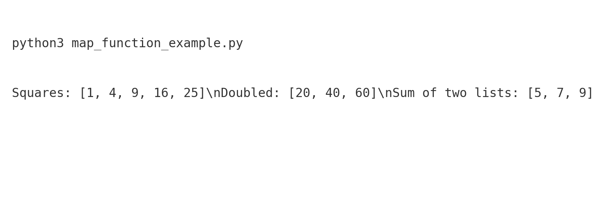
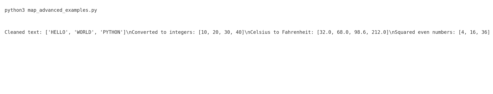

# Python Map Function Examples

This repository contains clear and practical examples of Python's built-in `map()` function.

## 🔥 What This Repo Covers

### Basic Examples
- Applying `map()` with normal functions  
- Using `map()` with lambda expressions  
- Mapping multiple iterables  

### Advanced Examples
- Cleaning text with `map()`  
- Converting string numbers to integers  
- Temperature conversion  
- Combining `map()` with `filter()`  

## 📂 Project Structure

```
python-map-function-example/
├── map_function_example.py        # Basic map() usage
├── map_advanced_examples.py       # Advanced & real-world examples
├── requirements.txt               # Dependencies (none required)
├── images/
│   ├── screenshot_basic.png
│   └── screenshot_advanced.png
└── README.md
```

## 📸 Screenshots

Basic run output:



Advanced run output:



## 🚀 Running the Programs

```bash
python3 map_function_example.py
python3 map_advanced_examples.py
```

## ✅ Python Version

Works with Python 3.8+ and requires no external libraries.

## 🤝 Contributions

Pull requests are welcome! This repo is beginner-friendly and ideal for learning functional programming in Python.
